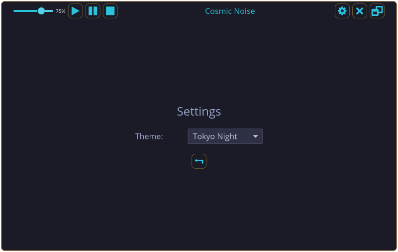
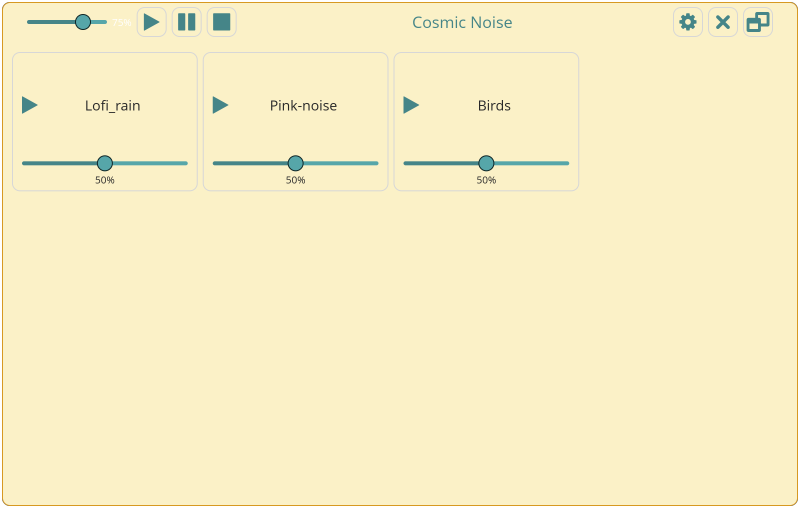

# Cosmic Noise

An ambient noise player built with Rust and Iced, heavily inspired by Blanket.

## Features

- 🎵 Multiple ambient sound tracks (rain, waves, birds, etc.)
- 🎚️ Individual volume control for each track
- 🎨 Multiple themes (Tokyo Night, Gruvbox, Catppuccin)
- 📦 Flatpak packaging for easy installation
- 🖥️ Cross-platform support

## Installation

### Flatpak (Recommended)

... to be added 

### From Source

```bash
# Clone the repository
git clone https://github.com/your-username/cosmic-noise.git
cd cosmic-noise

# Build the application
cargo build --release

# Run the application
./target/release/cosmic_noise
```

## Adding Your Own Sounds

Place your audio files in one of these directories:
- `~/.local/share/cosmic-noise/sounds/`
- `~/.config/cosmic-noise/sounds/`

Supported formats: MP3, OGG, FLAC, WAV


## Further development
[-] System tray
[-] Making global controls visibility dynamic
[-] Create pipeline to build mac/windows/linux builds (should depend on iced 0.14 when released)

## Gallery

Here are some screenshots showing the app in action:


*Main interface with multiple ambient tracks*


*Individual volume controls for each track*


*Theme selection and settings*

## License

This project is licensed under the MIT License - see the [LICENSE](LICENSE) file for details.

## Acknowledgments

- Sound files are licensed under various Creative Commons licenses - see [SOUNDS_LICENSING.md](SOUNDS_LICENSING.md) for details
- Inspired by [Blanket](https://github.com/rafaelmardojai/blanket)

