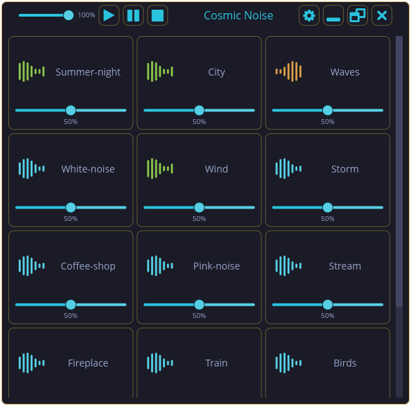
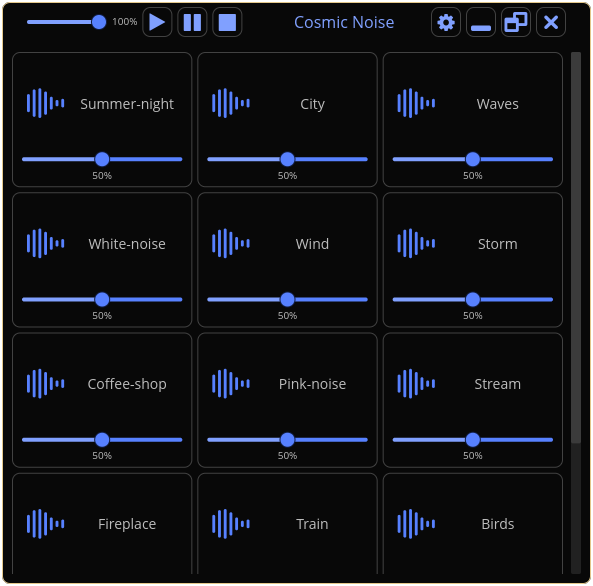

# Cosmic Noise
<a href="https://github.com/iced-rs/iced">
  
</a>

Many thanks to iced, its creator and the amazing discord community.

An ambient noise player built with Rust and Iced, heavily inspired by Blanket.

## Features

-  Multiple ambient sound tracks (rain, waves, birds, etc. they are basically taken from Blanke, i will add later background tracks unique to this player)
-  Individual volume control for each track
-  Multiple themes (Tokyo Night, Gruvbox, Catppuccin, and more to be added when UI settles in)
-  Cross-platform support (works on mac, win and linux, though linux is main focus)

## Installation

### From Source

```bash
# Clone the repository
git clone https://github.com/your-username/cosmic-noise.git
cd cosmic-noise

# Build the application
cargo build --release

# Run the application or just copy the binary to location that is on the path
./target/release/cosmic_noise
```

## Adding Your Own Sounds

Place your audio files in one of these directories: (keep in mind directories can differ, based on platform)
- `~/.local/share/cosmic-noise/sounds/`  Linux
- `~Library/Application Support/cosmic-noise/sounds/` Mac
Supported formats: MP3, OGG, FLAC, WAV


## Further development
- [ ] System tray
- [ ] Making global controls visibility dynamic
- [ ] Create pipeline to build mac/windows/linux builds (should depend on iced 0.14 when released)
- [ ] UI needs to be enhanced and improved
- [ ] Animations
- [ ] Packaging (flatpak, .msi, .app)
- [ ] Translations
## Gallery

Here are some screenshots showing the app in action:


*Main interface with multiple ambient tracks*


*Theme selection and settings*


*Individual volume controls for each track*




*Multiple tracks scrollbar*




*Multiple tracks with diff states*

## License

This project is licensed under the MIT License - see the [LICENSE](LICENSE) file for details.

## Acknowledgments

- Sound files are licensed under various Creative Commons licenses - see [SOUNDS_LICENSING.md](SOUNDS_LICENSING.md) for details
- Inspired by [Blanket](https://github.com/rafaelmardojai/blanket)

